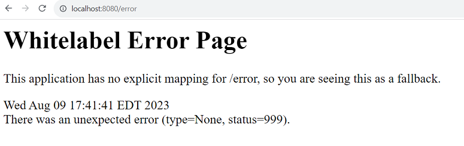

# Getting Started

### Wednesday Demo Steps

After setting up the project, we looked at the application.properties and played around with changing the `server.port=8081` then put it back to the default 8080

In the Spring Boot Dashboard, we started up the server and looked at what was returned when we navigated to `http://localhost:8080` in our browser. It redirected us to /error.



Next we added an `index.html` file in the src/main/resources/static folder. This is where Spring web looks for the homepage in our project structure. 


```html
<!DOCTYPE html>
<html>
	<head>
		<title>Hello World</title>
	</head>
	<body>
		<h1>
			Hello!
		</h1>
	</body>
</html>
```

* * * 
NOTE:
We are not using Spring Boot to serve html pages, so do not worry about how it renders views. If you see Spring Boot tutorials using the thymeleaf templating engine, this is not the way we are using Spring. We are only adding index.html to have a visual test of if the web server is working.
* * *

Now you can see your application is running, let's create a web api that returns data from a database.

#### Steps

1. Set up your project structure to look like:

    

    Notice the packages for the controllers, models, repositories, and services are all at the same level as the `SpringBootRestApiApplication.java` file. This is **important**. The `@ComponentScan` is only looking at this package. If your classes are outside they will not be scanned and added to the ApplicationContext. 
    ```java
    package com.skillstorm;

    // imports go here

    @SpringBootApplication // convenience annotation short for
    // @SpringBootConfiguration, 
    // @EnableAutoConfiguration and 
    // @ComponentScan
    public class SpringBootRestApiApplication {

        public static void main(String[] args) {
            SpringApplication.run(SpringBootRestApiApplication.class, args);
        }

    }
    ```

    Otherwise, you would need to specify what packages to scan explicitly.

    `@ComponenetScan(basePackages = {"some.other.package.controllers", "some.other.package.services","some.other.package.repositories"})`

    SHOULD NOT HAVE TO USE THE ABOVE explicit scan if you follow the package structure convention. 

2. We created a class `MovieController` with several methods for handling incoming http requests. Each method is associated with a unique api endpoint-url and http-verb combination. 

    The request handlers we wrote were:

    | Http Verb | Api Endpoint URL |
    |----------|------------------|
    | GET | /movies/v1/ |
    | GET | /movies/v1/{id} |
    | POST | /movies/v1/ |
    | PUT | /movies/v1/{id} |
    | DELETE | /movies/v1/{id} |


### Reference Documentation
For further reference, please consider the following sections:

* [Official Apache Maven documentation](https://maven.apache.org/guides/index.html)
* [Spring Boot Maven Plugin Reference Guide](https://docs.spring.io/spring-boot/docs/2.7.14/maven-plugin/reference/html/)
* [Create an OCI image](https://docs.spring.io/spring-boot/docs/2.7.14/maven-plugin/reference/html/#build-image)
* [Spring Web](https://docs.spring.io/spring-boot/docs/2.7.14/reference/htmlsinge/index.html#web)

### Guides
The following guides illustrate how to use some features concretely:

* [Building a RESTful Web Service](https://spring.io/guides/gs/rest-service/)
* [Serving Web Content with Spring MVC](https://spring.io/guides/gs/serving-web-content/)
* [Building REST services with Spring](https://spring.io/guides/tutorials/rest/)

